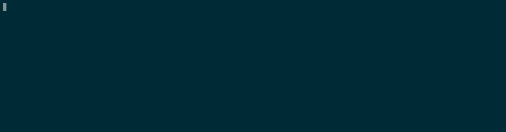

# trackit

`trackit` is a command-line tool that listens for changes in a user-supplied directory. Whenever there is a change, a custom command is executed and its standard output is shown live in the terminal.



## Examples

Show a live listing of the files in the current directory:

    > trackit --watch-dir=. --command="ls --color"

Show a live revision graph of a Git repository:

    > GIT_DIR=`git rev-parse --git-dir`
    > trackit --watch-tree=$GIT_DIR --command="git log --graph --all --oneline --decorate --color"

## Installation

`trackit` can be installed from [Hackage](https://hackage.haskell.org/package/trackit) using Cabal:

    > cabal new-install trackit

## Usage

Run `trackit -h` to get more information about available flags.

`trackit` starts a new buffer in the terminal and uses it to display the output of the command given as the `--command` flag. The display reacts to the following keyboard events:

  * **q** - Quit `trackit`.
  * **arrows/vi keys** - Scroll the output buffer (also with PgUp/PgDown/Home/End). The available vi-style bindings are h/j/k/l/C-u/C-d.
  * **space key** - Re-run the command and update the buffer. This is useful if no watch directory is provided, or if the output is affected by events outside of the watch directory.

When multiple changes occur in a short time in the watched directory (e.g. when switching branches in a repository), it may not be desired to have `trackit` react to every single change. This is especially the case if the monitored command is expensive (e.g. `git log` in a large repository). For this reason, `trackit` requires a *stabilization period* before running an update. If an event occurs during that period, the period clock is restarted and the update is delayed further.

The stabilization period can be set in milliseconds using the `--stabilization` flag. A lower value gives quicker response times, but increases the risk of getting spurious updates when a tight sequence changes occurs in the watched directory. The default stabilization period is 200 ms.

### Incremental output

The flag `--incremental` can be used to see partial output from slow commands. It will show the output line by line. Note, however, that each new line causes the display to be redrawn. This can lead to unnecessary flickering for fast outputs.

Here is an example demonstrating the incremental feature:

    trackit -i -c 'echo 1 && sleep 0.2 && echo 2 && sleep 0.2 && echo 3 && sleep 0.2 && echo 4 && sleep 0.2 && echo 5 && sleep 0.2 && echo 6 && sleep 0.2 && echo 7 && sleep 0.2 && echo 8 && sleep 0.2 && echo 9 && sleep 0.2 && echo 10 && sleep 0.2 && echo 11 && sleep 0.2 && echo 12 && sleep 0.2 && echo 13 && sleep 0.2 && echo 14 && sleep 0.2 && echo 15'

If the output exceeds the height of the terminal, you might want to use the flag `--follow-tail` to automatically scroll to the end as new lines are generated.

## Comparison to `watch`

`trackit` offers two main advantages over the similar tool [watch](https://linux.die.net/man/1/watch):

  1. `trackit` only reacts to file system changes. This avoids having to run a potentially costly command periodically. For example, the following command can easily consume a substantial part of your processor's cycles when run in a large repository:

     ```
     > watch -c -t -n 0,5 -- git log --graph --all --oneline --decorate --color
     ```

  2. `trackit` supports scrolling, and keeps the scrolled view even if the output is updated.

## Tips and tricks

### Merging `stdout` and `stderr`

`trackit` only listens to `stdout` from the given command. This means that anything written to `stderr` will be ignored. In order to make sure that `stderr` is also captured, the two streams can be interleaved. This can be done by appending `2>&1` to the command (tested on Linux).

For example, the following will show an error message when run outside of a Git repository:

    > trackit -c "git status 2>&1"

### `git status`

`git status` is slightly tricky to track using `trackit`. The reason is that the command creates a temporary lock file in the `.git` directory, resulting in a feedback loop between `trackit` and `git status` (if `trackit` listens for changes in the `.git` directory).

Since version 2.16, Git supports the flag `--no-optional-locks`, which prevents commands like `git status` to create locks. So we can use the following to track the result of `git status`:

    trackit -t . -c "git --no-optional-locks -c color.ui=always status"

This command also forces colored output, which is useful if this option hasn't been set globally.

### Haskell compilation

It is possible to use `trackit` to check Haskell code upon changes (emulating [`ghcid`](https://github.com/ndmitchell/ghcid)).

Using GHC directly:

    trackit -i -f -t . -c "ghc --make -O0 -fno-code -fdiagnostics-color=always file.hs 2>&1"

  * `-O0 -fno-code` are used to speed up compilation, assuming one is only interested in finding errors.
  * Consider also using [`cabal-cargs`](http://hackage.haskell.org/package/cabal-cargs) to pick up flags from the Cabal file and pass them to GHC.

Using Cabal:

    trackit -i -f -t . -c 'cabal new-build --ghc-options="-fdiagnostics-color=always" 2>&1'

### Dhall

It is possible to achieve [`ghcid`](https://github.com/ndmitchell/ghcid)-like
behavior for [`dhall`](https://github.com/dhall-lang/dhall-lang) files using
`trackit`:

    trackit -c "cat ./file.dhall | dhall 2>&1 " -d . -f
